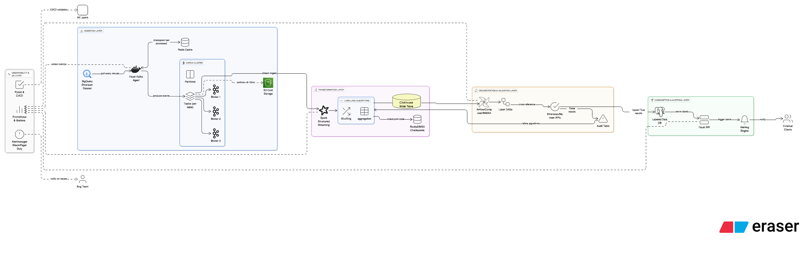

# **Realtime Wallet Labelling Challenge**

This repository presents a robust, end-to-end pipeline designed to generate valuable labels for blockchain addresses, empowering investors to make smarter on-chain decisions as part of Nansen's Challenge.

I have engineered a scalable, real-time architecture and implemented a core segment from data ingestion to a downstream initial labeling logic proving the viability of the architecture with a tangible, working model. This approach demonstrates a strong ability to translate a complex design into a functional, value-driven solution, emphasizing practical execution and a commitment to delivering results to users.

## **Index**

1. [Architecture overview](#architecture-overview)
2. [Setup Instructions](#setup-instructions)
3. [Technology choices and trade-offs](#technology-choices-and-trade-offs)
4. [Future-Improvement Roadmap](#future-improvements-roadmap)

# **Architecture overview**



## **1\. Ingestion Layer: High-Throughput and Resilient Data Sourcing**

* Data Source: The pipeline begins with the **bigquery-public-data.crypto\_ethereum** dataset, which serves as the canonical source for all on-chain activity including transactions, logs, traces, and token transfers.
* Real-time Ingestion Agent: A Kafka based Faust asynchronous processing service, deployed as a Docker container, is responsible for polling BigQuery.
  * Frequency: The agent triggers every minute to fetch new data, ensuring low latency.
  * Idempotency: To prevent duplicate processing during ingestion, the agent uses an external Redis cache to checkpoint the last processed timestamp & block number with tx\_hash for each table. This guarantees that each record is ingested exactly once, even if the service restarts.
* Kafka Cluster: The ingested data is produced into a highly available Kafka cluster.
  * Topics: Each BigQuery table (**transactions, logs**, etc.) has its own dedicated Kafka topic for clear data lineage and modular processing.
  * Scalability: The cluster is configured with 3-5 brokers, and topics are created with 32-64 partitions and a replication factor of 3-5 to handle high volume and ensure fault tolerance.
* Data Archival: A data lifecycle policy is enforced on Kafka topics. Data older than 6-12 months is automatically archived to an S3 cold storage bucket for long-term, cost-effective storage and compliance.

## **2\. Transformation Layer: Near Real-Time Algorithmic Labeling**

* Processing Engine: The core transformation logic is implemented using Apache Spark's Structured Streaming. This provides a powerful engine for complex, stateful operations at scale.
* Label-Specific Jobs: Each labeling heuristic (e.g., "Hot Wallet," "DeFi Power User") is encapsulated in its own separate Spark job. This modular approach allows for independent development, deployment, and scaling of each labeling algorithm.
* Stream Processing: The jobs process data in near real-time with a 10-minute tumbling window and a 5-minute watermark. This allows for handling late-arriving data gracefully while enabling complex joins and aggregations across multiple data streams (e.g., joining transactions with token transfers).
* State Management: Spark's checkpointing mechanism is used to maintain state (e.g., running counts, unique address sets). Initially configured with RocksDB for local state storage, this can be seamlessly upgraded to a distributed filesystem like S3/HDFS for enhanced resilience in a larger cluster environment.

## **4\. Orchestration and Validation Layer: Ensuring Data Quality and Reliability**

* Workflow Orchestration: Apache Airflow (deployed via Google Cloud Composer, AWS MWAA, or on a dedicated server) manages the final step of the data pipeline.
  * Label-Based DAGs: Separate DAGs are created for each label. These DAGs are responsible for reading aggregated, labeled data from ClickHouse, applying final business logic or thresholds, and upserting the results into the PostgreSQL table.
* Data Validation: Before being served, the labeled addresses are cross-referenced with trusted public sources like the Etherscan or Nansen APIs.
  * Feedback Loop: Any discrepancies or false positives are logged to a separate audit table. This creates a valuable feedback loop for data scientists and engineers to continuously refine and improve the labeling algorithms.

## **5\. Consumption & Alerting Layer: Delivering Actionable Insights**

* API Layer: A lightweight Faust-based API serves the final, validated labels from the PostgreSQL database. This API is designed for fast, low-latency queries, suitable for powering user-facing dashboards and applications.
* Agentic Alert System: Built on top of the API and the streaming infrastructure, an intelligent alerting system allows users to monitor specific addresses or labels. Similar to a perplexity stock monitoring tool, it can send automated notifications (via webhook, email, or other channels) when significant events occur, empowering users to make timely, data-informed decisions.

## **6\. Observability and Quality Assurance Layer**

* Metrics & Monitoring (Prometheus & Grafana)
  * Data Collection: Gathers key performance metrics (e.g., latency, throughput, error rates) from all services.
  * Visualization: Real-time Grafana dashboards track both system-level operational health and business-level labeling performance.
* Automated Testing (Pytest & CI/CD)
  * Validation: A robust **pytest** suite validates code logic, component integrations, and data integrity within the databases.
  * Quality Gating: Integrated into a CI/CD pipeline to prevent un-tested code from being deployed.
* Proactive Alerting (Alertmanager)
  * Real-time Notifications: Automatically sends alerts via Slack or PagerDuty for both system failures (e.g., job crashes) and data anomalies (e.g., no new labels).
  * Rapid Response: Enables the engineering team to detect and resolve issues quickly, minimizing downtime and impact.

# **Setup Instructions**

## Prerequisites

### Required Software

- Docker & Docker Compose (v3.8+)
- Git
- At least 8GB RAM available for Docker
- 20GB free disk space for data persistence

### Required Credentials

- Google Cloud Service Account with BigQuery access
- Credentials file saved as `credentials.json` in the root directory

### Environment Variables

Create a `.env` file in the root directory with the following variables:

```bash

# Database Credentials

DB_USER=your_db_user

DB_PASSWORD=your_strong_password


# Redis Password

REDIS_PASSWORD=your_redis_password


# Google Cloud Configuration

GOOGLE_CLOUD_PROJECT=your-gcp-project-id

```

## Quick Start

### 1. Clone and Setup

```bash

# Clone the repository

git clone <repository-url>

cd nansen_challenge

# Create environment file

cp .env.example.env

# Edit .env with your credentials

```

### 2. Prepare Google Cloud Credentials

```bash

# Place your GCP service account key in the root directory

cp /path/to/your/service-account-key.json./credentials.json

```

### 3. Start Infrastructure Services

```bash

# Start core infrastructure (Kafka, Redis, ClickHouse, PostgreSQL)

docker-compose up-dkafkaredisclickhousepostgres


# Verify services are healthy

docker-compose ps

```

### 4. Start Processing Services

```bash

# Start all processing services

docker-compose up-dextract_ethereum_transactionsexport_hot_walletsupdate_hot_wallet_labels


# Or start individual services as needed

docker-compose up-dextract_ethereum_transactions

```

### 5. Monitor Services

```bash

# View logs

docker-compose logs-fextract_ethereum_transactions

docker-compose logs-fexport_hot_wallets


# Access UIs

# Kafka UI: http://localhost:18080

# Redis Insight: http://localhost:15540

# ClickHouse: http://localhost:18123

# PostgreSQL (pgweb): http://localhost:8081

# Spark Master UI: http://localhost:38080

```

## Service Descriptions

### 1. Extract Ethereum Transactions (`extract_ethereum_transactions`)

**Purpose**: Extracts Ethereum transactions from BigQuery and streams them to Kafka

**Features**:

- Near real-time extraction using Faust streaming framework
- Deduplication using Redis
- Configurable batch sizes and time windows
- Comprehensive error handling and logging

**Environment Variables**:

-`KAFKA_BROKER`: Kafka broker connection string

-`KAFKA_TOPIC`: Topic name for Ethereum transactions

-`REDIS_URL`: Redis connection string

-`GOOGLE_APPLICATION_CREDENTIALS`: Path to GCP credentials

-`GOOGLE_CLOUD_PROJECT`: GCP project ID

### 2. Export Hot Wallets (`export_hot_wallets`)

**Purpose**: Processes transaction streams to identify "hot wallets" using Spark Structured Streaming

**Features**:

- Real-time stream processing with Spark
- Sliding window analysis for transaction frequency
- Automatic schema evolution
- ClickHouse integration for analytics storage
- Checkpoint management for fault tolerance

**Environment Variables**:

-`KAFKA_BROKER`: Kafka broker connection string

-`KAFKA_TOPIC`: Source Kafka topic

-`CHECKPOINT_DIR`: Directory for Spark checkpoints

-`CLICKHOUSE_URL`: ClickHouse connection URL

### 3. Update Final Table (`update_hot_wallet_labels`)

**Purpose**: Updates the final PostgreSQL table with wallet labels and categories

**Features**:

- Reads processed data from ClickHouse
- Updates PostgreSQL with wallet classifications
- Upsert operations with conflict resolution
- Comprehensive error handling

**Environment Variables**:

-`POSTGRES_DATABASE_URL`: PostgreSQL connection string

-`CLICKHOUSE_HOST`, `CLICKHOUSE_PORT`: ClickHouse connection details

-`CLICKHOUSE_USER`, `CLICKHOUSE_PASSWORD`: ClickHouse credentials

-`CLICKHOUSE_DATABASE`: Target database name

## Data Flow

1.**BigQuery** → Ethereum transactions are fetched from public dataset

2.**Kafka** → Transactions are streamed through `ethereum.mainnet.transactions` topic

3.**Spark** → Real-time processing identifies hot wallets using sliding windows

4.**ClickHouse** → Time-series analytics data is stored for further analysis

5.**PostgreSQL** → Final wallet labels and categories are maintained

## Database Schemas

### ClickHouse - labels_wide_table (evolving schema)

```sql

CREATETABLE labels_wide_table (

address String,

    window_start_time DateTime,

    window_end_time DateTime,

    hot_wallet_txn_count_10m UInt64,

    inserted_at DateTimeDEFAULTnow()

) 

ENGINE = MergeTree() 

ORDER BY (address, window_start_time)

PARTITIONBY toYYYYMM(window_start_time)

```

### PostgreSQL - wallet_labels

```sql

CREATETABLE wallet_labels (

addressVARCHAR(42) PRIMARY KEY,

    label VARCHAR(255) NOT NULL,

    category VARCHAR(255),

    last_updated_at TIMESTAMPDEFAULT CURRENT_TIMESTAMP

);

```

## Development

### Running Individual Services

```bash

# Test Kafka connectivity

docker-compose upkafka-test


# Test BigQuery connectivity  

docker-compose upbigquery-test


# Run only extraction service

docker-compose upextract_ethereum_transactions


# Run only hot wallet detection

docker-compose upexport_hot_wallets

```

### Debugging

```bash

# Check service logs

docker-compose logs-f <service_name>


# Access service containers

docker-compose exec <service_name> /bin/bash


# Restart specific service

docker-compose restart <service_name>

```

### Data Persistence

All data is persisted in the `./data/` directory:

-`./data/kafka/`: Kafka logs and metadata

-`./data/clickhouse_data/`: ClickHouse database files

-`./data/postgres_data/`: PostgreSQL database files

-`./data/redis/`: Redis persistence files

-`./data/spark_checkpoints/`: Spark streaming checkpoints

### Scaling Considerations

For production deployment:

- Set `KAFKA_TOPIC_PARTITIONS=32-64` for better parallelism
- Set `KAFKA_TOPIC_REPLICATION_FACTOR=3` for fault tolerance
- Increase Spark worker replicas in docker-compose.yml
- Configure appropriate memory limits for each service
- Use external managed services (e.g., Confluent Cloud, AWS RDS)

## Monitoring & Observability

### Health Checks

All services include health checks that can be monitored:

```bash

docker-compose ps# Shows health status

```

### Log Files

Application logs are available in:

-`./logs/extract_ethereum_transactions/`: Extraction service logs

- Container logs via `docker-compose logs`

### Metrics & Monitoring

- Kafka UI: Monitor topics, partitions, consumer lag
- Spark UI: Monitor streaming jobs, stages, and performance
- Redis Insight: Monitor cache hit rates and memory usage

# Technology choices and trade-offs

| Tool Chosen                          | Why It Fits (Strengths)                                                                                                                                                                                                       | Key Trade-Offs                                                                                                                        |
| :----------------------------------- | :---------------------------------------------------------------------------------------------------------------------------------------------------------------------------------------------------------------------------- | :------------------------------------------------------------------------------------------------------------------------------------ |
| BigQuery (public crypto\_ethereum)   | Free upto 1tb query scans, readily indexed on-chain data. No need to manage.                                                                                                                                                  | 4-min ingestion lag; true real-time impossible, like with RPC end points. Very expensive, if the free query scan is exceeded          |
| Kafka (KRaft mode)                   | High-throughput, durable log; partitioning gives horizontal scale. Real time is possible. KRaft removes ZooKeeper → simpler ops. Able to off-load to cold storage.                                                           | Operates best with ≥3 brokers ⇒ higher local resource needs. Requires tuning, maintenance to avoid latency spikes and consumer lags |
| Faust Ingestion Agent (Python)       | Native Kafka stream API\+ Record schema typing. Seamless async polling & exactly-once with Redis checkpoint.                                                                                                                  | Faust's project developments and supports are quite slow.                                                                             |
| Redis Checkpoint Cache               | µs-latency key–value store, perfect for last-seen checkpoints. Simple Docker deploy                                                                                                                                         | Data lives in RAM, should be careful about what is stored with pre-calculated size.                                                   |
| Spark Structured Streaming           | Scalable from single machine setup to cluster; integrates with S3/HDFS. Handles multi-topic joins (tx ⊕ token\_transfers) and 10-min tumbling windows; JVM job is containerised so reviewers rundocker compose up sparkonce. | In memory data processor, should monitor and optimise jobs to escape OOM errors. Micro-batch model (≥100 ms) not sub-second          |
| ClickHouse (labels\_wide\_table)     | Schema-on-write but supports ALTER ADD COLUMN for evolving labels. Columnar MergeTree → millisecond analytics on 10⁺ TB                                                                                                     | NULL                                                                                                                                  |
| PostgreSQL                           | Simple UPSERT keeps only freshest label per address → small, fast table for APIs & alert joins.                                                                                                                              | NULL                                                                                                                                  |
| Airflow (Composer / MWAA)            | DAG abstraction per label lets reviewers see orchestration logic without looking at the logic code. UI for retry, SLA, backfills                                                                                              | Should maintain proper environment, credentials for multiple DAGs and tasks in Composer or MWAA                                       |
| Prometheus\+ Grafana \+ Alertmanager | Single dashboard shows Kafka lag\< 1 min, throughput, memory usage, PromQL support for alert manager rules.                                                                                                                   | Initial dashboard setup is a boring manual process                                                                                    |

# Future-Improvement Roadmap

* Expand beyond the initial hot-wallet heuristic to a library of label algorithms (whales, bridges, scams, NFT hubs) for deeper insights.
* Finish the observability stack — fully instrument Prometheus/Grafana and enforce Pytest-driven unit \+ integration tests for code and data quality gates.
* Add a nightly validation DAG that calls Etherscan/Nansen APIs, writes audit results, and retrains/refines rules on drift.
* Harden orchestration with fine-grained, SLA-aware Airflow DAGs that support back-fills and clear label dependencies.
* Ship a production-ready FastAPI/Faust service plus agentic alerts that push real-time notifications on label-triggering events.
* Back-fill history by pulling full-archive data from alternative RPC node providers into Kafka, closing any gaps beyond BigQuery’s retention.
* Extend the data model to allow multiple concurrent labels per address, ensuring we capture every relevant classification without loss.
